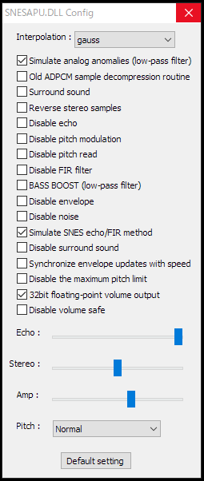

# in_snesapu

in_snesapu.dll is a plug-in that allows you to use degrade-factory improved SNESAPU.DLL (for other players) with XMPlay.  

  

in_snesapu.dll (x86)  
  
Usage: ------------------------  
in_snesapu.dll is a plugin that allows you to use degraded-factory's improved SNESAPU.DLL (for other players) with XMPlay. You need to download the improved SNESAPU.DLL (for other players) from https://dgrfactory.jp/spcplay/ and place it in the same folder as in_snesapu.dll.  
  

Note: -------------------------  
We recommend SNESAPU.DLL version 2.20.0 or higher. Even if the recommended version or higher is used, it may not work due to DLL specification changes, etc.  
  
We have not confirmed that   in_snesapu.dll works with XMPlay file version 3.8.5.0 or lower. Also, it may not work with future changes in XMPlay's specifications.  
  
Please check for viruses before using in_snesapu.dll.  
  
  
Disclaimer: -------------------  
No Warranty. Use at your own risk.  

  
Other: ------------------------  
XMPlay's PCM data is received as float (IEEE 754), and the improved SNESAPU.DLL seems to calculate waveforms internally using float, so the sample bit is fixed at 32bit. The sample rate is also fixed at 32000 Hz because the actual device is 32000 Hz and the explanation of SetAPUOpt() suggests that the reproducibility may drop. The mixing is also set to the highest quality float. For sample conversion, please use XMPlay's resampler or noise shaping which allows you to specify dithering separately.  
  
Message/Comments/Tags are displayed.
  
Script700 is not supported.  
  
The size of the DLL is large because it is built with /MT.  
  
All this DLL does is transcribe 32bit float PCM data received from SNESAPU.DLL to a float buffer prepared by XMPlay using movsd.  
  
  
  
XMPlayで設定できる項目の説明です。より詳細な解説は開発元のhttps://dgrfactory.jp/spcplay/snesapu.htmlをご覧ください。  
  
　Plugins->Input->in_snesapu.dll->Config  
　　----------------  
　　Interpolation(補間処理の選択)  
　　　none 　　　　　補間処理をしません
　　　linear 　　　　線形補間
　　　cubic　　　　　三次スプライン補間
　　　gauss　　　　　ガウス分布補間（実機と同じ）
　　　8-point sin　　シンク関数補間
　　　4-point gauss　高精度ガウス分布補間
　　----------------
　　Simulate analog anomalies (low-pass filter)
　　　カットオフ周波数のローパスフィルタを使います（実機と同じ）
　　Old ADPCM sample decompression routine
　　　古いBRR復元プログラムを使います（実機と同じ？）
　　Surround sound
　　　逆位相サラウンド効果を使います
　　Reverse stereo samples
　　　左右の音出力を入れ替えます
　　Disable echo
　　　エコーを無効にします
　　Disable pitch modulation
　　　ピッチモジュレーションを無効にします
　　Disable pitch read
　　　ピッチベンドを無効にします
　　Disable FIR filter
　　　FIRフィルタを無効にします
　　BASS BOOST (low-pass filter)
　　　低音強調します
　　Disable envelope
　　　エンベロープを無効にします
　　Disable noise
　　　ノイズ生成機能を無効にします
　　Simulate SNES echo/FIR method
　　　エコー時の処理を更に実機に近づけます
　　Disable surround sound
　　　サラウンドを無効にします
　　Synchronize envelope updates with speed
　　　エンベロープ効果を同期させます
　　Disable the maximum pitch limit
　　　ピッチの最大値を拡張します
　　32bit floating-point volume output
　　　内部関数で取得する音量値をfloatにします
　　Disable volume safe
　　　イヤーセーフ機能を無効にします
　　----------------
　　Echo　　エコーフィードバックの反転度を調整できます
　　Stereo　左右の音の拡散度を調整できます
　　Amp 　　ファイル再生時の音量を調整できます
　　----------------
　　Pitch 　ピッチを変更できます
